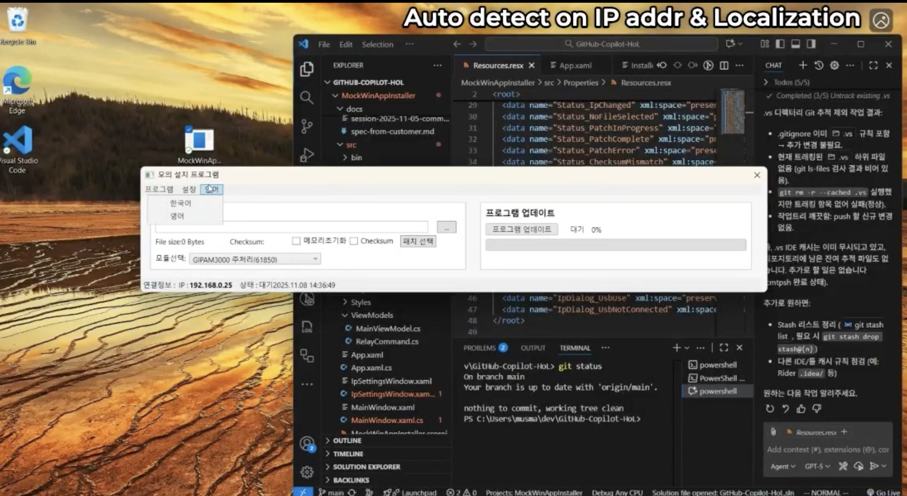
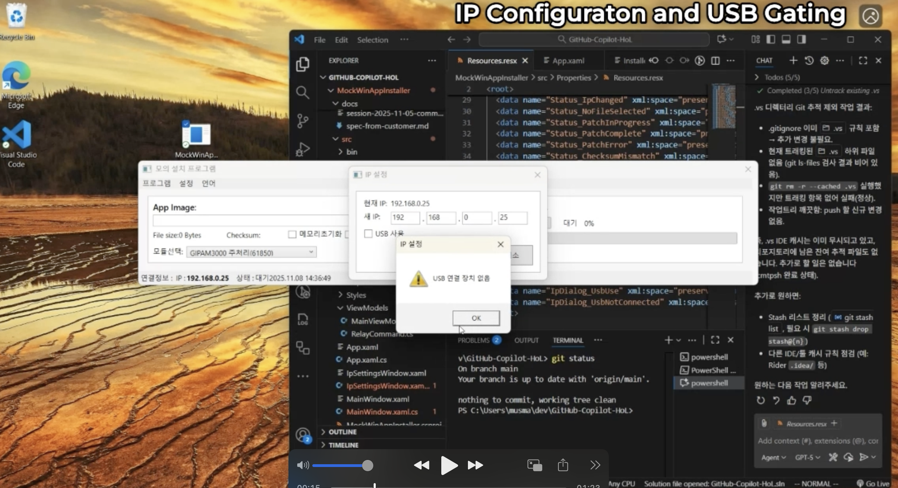
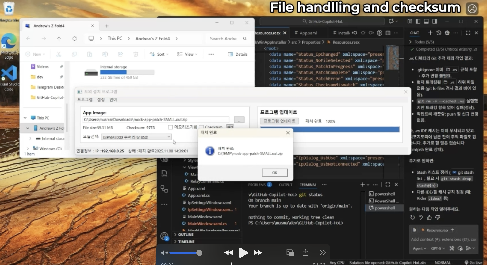

# MockWinAppInstaller

## 📦 Included Project
### 🔹 MockWinAppInstaller (C# / WPF)
A Proof-of-Concept (PoC) Windows app that simulates a firmware update process using:
- USB or Network connection
- File checksum validation
- Simulated update progress
- DNP / MODBUS protocol selection
- Multi-language UI (English / Korean)
- Localized logs and completion messages

All specifications and Copilot guidance are stored under  
[`MockWinAppInstaller/docs/copilot-instructions.md`](./docs/copilot-instructions.md)  
[`MockWinAppInstaller/docs/spec-from-customer.md`](./docs/spec-from-customer.md)  
[`MockWinAppInstaller/docs/mock-app-specification-detail.md`](./docs/mock-app-specification-detail.md) – Detailed functional & UI spec (dialogs, persistence, simulation, localization rules).
> ⚠️ spec-from-customer.md is encypted by git-crypt

 
## 🚀 Goal

Provide a lightweight, scriptable mock environment to iterate on installer UX, localization, and protocol workflow without requiring real devices.

## 🗂 Directory Structure (src excerpt)

```text
src/
  App.xaml
  MainWindow.xaml
  ViewModels/
  Services/
  Properties/
```

## 🛠 Tech Stack

- .NET 8
- WPF

## 📁 Key Folders

| Path | Purpose |
|------|---------|
| `MockWinAppInstaller/docs` | Developer and learning documentation |
| `MockWinAppInstaller/docs/assets` | Visual assets (architecture, wireframes) |
| `MockWinAppInstaller/src` | All application source code (MVVM + services) |
| `MockWinAppInstaller/src/ViewModels` | ViewModel classes for MVVM pattern |
| `MockWinAppInstaller/src/Services` | Service abstractions (file, checksum, simulation) |
| `MockWinAppInstaller/src/Properties` | Assembly and resource localization files |

## 🧩 Instruction Modules

### Core Instructions (Minimal Ingestion)

| Scope | File | Purpose |
|-------|------|---------|
| Global | `.github/copilot-instructions.md` | Repository-wide baseline rules |
| Path Base | `.github/instructions/MockWinAppInstaller.instructions.md` | Core delta for installer project |
| Path Testing | `.github/instructions/MockWinAppInstaller.testing.instructions.md` | Minimal test coverage guidance |
| Path Pitfalls | `.github/instructions/MockWinAppInstaller.pitfalls.instructions.md` | Common mistakes & mitigations |
| Agents | `AGENTS.md` | Role/style tags (git-mini, term-mini, code-mini, arch-pro) |

### Commentary Files (Onboarding & Extended Rationale)

For new team members or detailed context, see:

- **Global guidance**: `MockWinAppInstaller/docs/copilot-instructions-commentary.md`
- **Path-specific patterns**: `MockWinAppInstaller/docs/path-specific-instructions-commentary.md`
- **Agent profiles & escalation**: `MockWinAppInstaller/docs/AGENTS-commentary.md`

These commentary files expand on rules, provide examples, and explain trade-offs not included in the minimal instruction files.

## 🌐 Localization

Resource files: `Properties/Resources.resx`, `Properties/Resources.ko.resx` (extend with UI strings and messages).

## ▶️ Running (Windows)

```bash
# From solution root (future .sln placement)
dotnet build MockWinAppInstaller/src/MockWinAppInstaller.csproj
# To run:
dotnet run --project MockWinAppInstaller/src/MockWinAppInstaller.csproj
```

## 🪟 Windows Targeting & Cross-Platform Build

This project targets **`net8.0-windows`** with WPF. Key considerations:

- **Build on macOS/Linux:** The project sets `<EnableWindowsTargeting>true` in `MockWinAppInstaller.csproj`, allowing restore/build on non-Windows hosts. You can compile, but you *cannot* run the WPF UI outside Windows.
- **Run on Windows 10/11:** Execution (UI launch) requires a Windows environment. Use a local Windows machine, VM (e.g. Hyper-V, Parallels), or GitHub Actions Windows runner for automated validation.
- **Optional OS annotation:** You may add `[assembly: System.Runtime.Versioning.SupportedOSPlatform("windows10.0.22000")]` to indicate Windows 11 as the primary target.
- **Publish (Single File example):**

  ```bash
  dotnet publish MockWinAppInstaller/src/MockWinAppInstaller.csproj \
    -c Release \
    -r win-x64 \
    --self-contained true \
    /p:PublishSingleFile=true /p:IncludeNativeLibrariesForSelfExtract=true
  ```

- **Future multi-RID support:** Add `<RuntimeIdentifiers>win-x64;win-arm64</RuntimeIdentifiers>` for broader platform packaging.

If you split logic into a cross-platform class library (e.g. `MockWinAppInstaller.Core`), non-Windows hosts can unit test business logic without the WPF UI.

## 🔮 Next Steps (Optional)

- Bind `MainViewModel` to `MainWindow.xaml`
- Wire `UpdateSimulator` into a progress bar
- Add checksum input + validate button
- Expand localization keys
- Add basic unit tests

---
✅ Current Feature Summary (2025-11-05)

| Area | Implemented Details |
|------|---------------------|
| Localization | Dynamic culture switch (English/Korean) without restart (ResourceManager + property change) |
| File Handling | Browse patch file, display size & CRC16 checksum (source) |
| Patch Simulation | Async chunked copy to `C:\TEMP` with progress bar + completion/reset |
| Integrity | Destination CRC16 compared to source; mismatch triggers localized error dialog |
| IP Configuration | Segmented IPv4 entry (4 textboxes), per-octet validation + red highlight + focus on first invalid |
| IP Persistence | Last 10 IPs stored in `HKCU\Software\MockWinAppInstaller\RecentIps` (MRU order) |
| USB Gating | Heuristic USB-B detection (removable drive or filtered WMI PnP) disables IP edit when active |
| Status Messages | All major states localized (idle, progress, complete, mismatch, errors, language failure) |
| UI Layout Freeze | Agreed layout kept stable; only additive enhancements inside existing regions |

**Demo & Screenshots:**

- [Demo Video](https://cdn.microbiz.ai/public/GHE/MockAppWinInstaller-shorten.mp4)







## 🔐 Registry Usage

The application creates/updates `HKCU\Software\MockWinAppInstaller` with a string value `RecentIps` containing comma-separated MRU list (max 10). No other registry writes performed.

🧪 Future Test Targets
Minimal tests recommended next:
\n1. Octet validation (boundary & invalid cases).
2. CRC16 correctness for a known fixture.
3. MRU trimming logic (exceeding 10 entries).
4. USB heuristics (mock WMI searcher wrapper) – optional.

## 📄 Session Command Log File

Daily command summary stored at: `MockWinAppInstaller/docs/session-2025-11-05-commands.txt` (generated on request).

---
*README updated to reflect current implemented functionality.*
