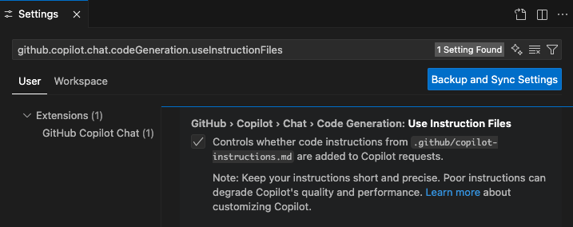
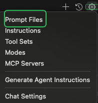
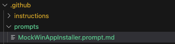
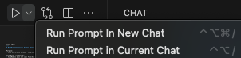
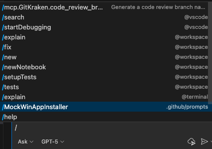
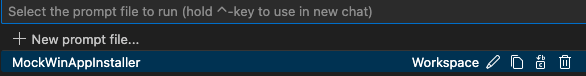
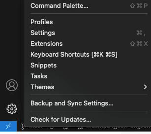
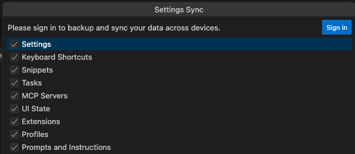

# Customizing GH Copilot Responses

# Copilot Instructions

* Give enough context, get better responses
* Applied and consumed across \<u>GH Copilot features\</u> such as : 
  * Copilot **Chat general Q\&A**
  * Coding **agent task** execution (baseline context)
  * **Code change / refactor** suggestions (/edit sessions, inline edit)
  * **Code review** assistance (automated review comments, improvement suggestions)
    > ℹ️ GH Copilot code review only reads upto \<u>4,000 characters\</u>
  * **Test** generation / documentation suggestions (uses **build/run/layout** hints)
  * **Multiple** **model backends** to keep consisitency across models
* Types of customization
  * 1\. **Repository custom instruction*****s******&#x20;***&#x66;or the codebase-wide context (*Effectiveness*)
    1. **Repo-wide :&#x20;**
       * `ROOT/.github/copilot-instructions.md`
    2. **Path-specific :** one or more overriding the repo-wide instruction
       * `.github/instructions/**/NAME.instructions.md`
    3. **Agent-specific :** can be placed in any path
       * `AGENTS.md`,`CLAUDE.md`, or`GEMINI.md`
       > 💡 Still limited to some of GH Copilot features above (as of Nov. 2025)
       > *"currently not supported by all Copilot features"* <br/>
       > ℹ️  By default, only `AGENTS.md` just under the root of a repository works
       > For the multiple `AGENTS.md` 
  * 2\. **Prompt files** : for instructions to a specific chat interation (*Usability and Efficiency*) 
    * `*.prompt.md`
    * No automatic injection; must manually copy/select a line and send
    > ℹ️  Only available for VS Code and JetBrains (as of Nov. 2025, still in Public Preview) 
  * Supportability across dev tools - IDE (‼️ *read carefully*)

    
    * GH Copilo&#x74;**&#x20;chat in VSCode** understands all types of repository custom instrunctions
      * but for the agent instructions, only `AGENTS.md` works 
    * GH Copilot coding **agent in VSCode** reads all types of repository custom instrunctions
    * GH Copilot **code review in VSCode** takes only the repository-wide instructions
    * GitHub.com in this context refers to the web-based Github platform


# How to use the custom instructons in VSCode

###### Use a .github/copilot-instructions.md

* Write up `.github/copilot-instructions.md` in the repo root 
* Enable the ⚙️`github.copilot.chat.codeGeneration.useInstructionFiles` setting
  > Copy and paste the following URI into the VSCode Command Palette :
  > `vscode://settings/github.copilot.chat.codeGeneration.useInstructionFiles`
  
* After pushing it to the remote repo, it can be listed as reference in GH Copilot chat (web) : 

  

> 💡 GH Copilot understands `#file:path/to/file.ext`, `#folder:path/to/folder`, etc.

###### Use path specific instructions.md

* Write up `.github/instructions/NAME.instructions.md`

  
  > -**&#x20;MockWinAppInstaller.instructions.md** : path specific baseline 
  > -**&#x20;MockWinAppInstaller.testing.instructions.md** : for testing
  > \- **MockWinAppInstaller.pitfalls.instructions.md** : to avoid recurring mistakes 
  > \- **MockWinAppInstaller.codeing-convention-instructions.md :&#x20;**&#x63;oding convention baseline
* No additional configuration is needed to use 😜
* For several specific scenarios such as **Code Review**,**&#x20;Commit message generation**, and **PR** : 

  👉 [Specify custom instructions in (VSCode) settings](https://code.visualstudio.com/docs/copilot/customization/custom-instructions#_specify-custom-instructions-in-settings)

###### Use Agent instructions.md

* Write up `AGENTS.md` just under the root or in the sub folders (or `CLAUDE.md`, `GEMINI.md`)
* Enable the ⚙️`chat.useAgentsMdFile` and ⚙️`chat.useNestedAgentsMdFiles` settings

  
  > Copy and paste the following URI into the VSCode Command Palette :
  > `vscode://settings/chat.useAgentsMdFile
  > vscode://settings/chat.useNestedAgentsMdFiles`
* A sample usage of AGENTS.md

```markdown
Agent: git-mini
Scope: core git verbs & single-conflict fix. Behavior: terse 1–2 bash lines. Escalate if structural or security impact.

Agent: term-mini
Scope: glossary/acronym ≤3 sentences. Behavior: neutral; no links unless asked. Escalate when design/security/perf trade-offs appear.

Agent: code-mini
Scope: micro code edits (≤15 changed lines, ≤2 files) or tiny diff clarifications. Behavior: concise patch intent + summary; no deep architecture rationale. Escalate to arch-pro if refactor spans >2 files or introduces pattern. Use when user asks "just fix" or "small patch". Avoid adding deps.

Agent: arch-pro
Scope: architecture, refactor, performance (with metrics), security modeling. Behavior: Structured (Problem, Options, Trade-offs, Recommendation, Edge tests).
```

You can mention the above in GH Copilot chat in VScode (*cmtpsh = commit and push all the changes*): 


###### Use Prompt files (Workspace) 

* Choose the location of the prompt file 

> By default, `.github/prompts/`; if you want to add another : 
> ⚙️`chat.promptFilesLocations `settings
> `vscode://settings/chat.promptFilesLocations`

* Create a prompt file in VSCode 






* Manully you can inject the prompth file in various way : 

1. Press the play button in the editor title area



1. Type `/` followed by the prompt file name in the chat 



1. Or open the Command Palette ⇧⌘P, **Chat: Run Prompt,&#x20;**&#x61;nd  select the prompt file 




###### How to sync VSCode settings across multipe devices

&#x20;   Simple but very convinient in case of you have more than one dev laptop or VMs






# Best Practices

###### How to decide what goes in a prompt file vs custom instructions

| **Repository custom instructions**                                                            | **Prompt files**                                                                                                                            |
| --------------------------------------------------------------------------------------------- | ------------------------------------------------------------------------------------------------------------------------------------------- |
| Build/test commands everyone must always know                                                 | Specific repeatable tasks (e.g., “Add accessibility attributes”)                                                                            |
| Coding style rules                                                                            | Concrete refactor/test/documentation requests                                                                                               |
| Project architecture summary                                                                  | Recurrent ad-hoc actions                                                                                                                    |
| Prohibited dependencies (such as libraries, package managers, specific versions or framworks) | Specialized transformations (such as bulk update, refactoring, or migratons in which you ca&#x6E;**&#x20;just copy and paste the prompts**) |

> 🧠 **Andrew's recommendation**: ask your GH copilot if the instruction is well-documented :-) 

###### Good length guideline 

* Repository custom instructions
  * ≤ \~500–600 words total
  * ≤ 2,000 Korean chars total
* Prompt files 
  * Each line ≤ \~160 chars; (≤ \~100 Korean chars)
  * 15–30 total prompts (prune >50)


###### Best practice for repository custom instructions

| **Category**           | **Best Practice**                                                                              | **Rationale / Effect**                                                  | **Example&#x20;**                                                                                  |
| ---------------------- | ---------------------------------------------------------------------------------------------- | ----------------------------------------------------------------------- | -------------------------------------------------------------------------------------------------- |
| Purpose / Overview     | Start with a 3–6 line summary (languages, frameworks, build system, primary goal).             | Gives the model fast, correct context; reduces wrong stack assumptions. | “TypeScript + React monorepo using pnpm workspaces and Vitest; internal design system components.” |
| Core Commands          | List install / dev / build / test / lint / run commands in verified order.                     | Prevents wrong or outdated command suggestions; reduces exploration.    | “Install: pnpm install → Dev: pnpm dev → Test: pnpm test → Build: pnpm build.”                     |
| Mandatory Steps        | Prefix non‑skippable steps with a consistent keyword like “Always” / “Must”.                   | Avoids the model treating critical steps as optional.                   | “**Always** run pnpm test before large refactors.”                                                 |
| Project Structure      | Enumerate only 5–10 key top‑level directories with short purpose notes.                        | Saves tokens; improves accurate path references.                        | “/packages/ui – shared components; /packages/api – REST handlers…”                                 |
| Style / Coding Rules   | Bullet concise, undisputed rules (preferred & forbidden patterns).                             | Raises generated code quality; lowers review overhead.                  | “React: function components only; Imports: use path aliases; No console.log.”                      |
| Prohibited Items       | Explicitly list banned package managers, libraries, patterns, weak algorithms.                 | Prevents the model from introducing bad dependencies or insecure code.  | “No yarn, no moment, no axios, no global singletons.”                                              |
| Testing Strategy       | State coverage focus (edge cases, negative paths, performance) & minimum requirements.         | Reduces trivial tests; increases meaningful suggestions.                | “Include negative input tests, date boundary cases, concurrency scenarios.”                        |
| Clarification Triggers | Define when the model must ask before acting (schema changes, new deps, build pipeline edits). | Prevents unapproved large or breaking changes.                          | “If a DB schema change is implied → ask for confirmation first.”                                   |
| Sentence Style         | Use short, declarative, imperative statements; avoid fluff or emotional tone.                  | Reduces token waste; improves parsing consistency.                      | “Prefer native Date APIs.”                                                                         |
| Length Limit           | Keep to ≤ \~2 pages (\~400–600 words) using bullets.                                           | Avoids truncation; preserves essential info.                            | Concise bullet blocks instead of long paragraphs.                                                  |
| Exception Handling     | Explicitly state when interactive questioning is required.                                     | Stops silent large destructive changes.                                 | “Ask before large schema migration or adding dependencies.”                                        |
| Tone Minimization      | Avoid demands for humorous or verbose style.                                                   | Preserves technical focus.                                              | Skip stylistic prose mandates.                                                                     |
| Limited External Links | Include only essential canonical docs (1–2 links).                                             | Keeps focus on local canonical info.                                    | Link to official framework docs only.                                                              |

###### Best practice for prompt files

| **Category**          | **Best Practice**                                          | **Rationale / Effect**                                                          | **Example&#x20;**                                                                          |
| --------------------- | ---------------------------------------------------------- | ------------------------------------------------------------------------------- | ------------------------------------------------------------------------------------------ |
| Structure             | One actionable imperative per line                         | Keeps each request atomic; easy to select & run without ambiguity.              | Rewrite #file:src/utils/date.ts to simplify leap-year logic.                               |
| Clarity / Goal Focus  | Be specific about goals (“focus on edge cases”)            | Directs model toward higher‑value, deeper coverage instead of generic output.   | Generate unit tests for #file:src/utils/date.ts focusing on leap years and DST boundaries. |
| Task Framing          | Use incremental verbs (“Refactor”, “Add tests”, “Explain”) | Encourages stepwise, reviewable outputs over massive rewrites.                  | Refactor #file:src/components/Table.tsx to remove duplicated pagination logic.             |
| Context Anchoring     | Reference concrete targets (#file, #folder)                | Ensures correct context ingestion; reduces hallucinated paths.                  | Add integration tests for #folder:src/auth covering token refresh race conditions.         |
| Brevity / Scanability | Keep file short (scannable)                                | Increases adoption; users quickly find the right prompt; reduces noise.         | (Maintain ≤ \~1 screenful; prune low‑value lines.)                                         |
| Maintenance           | Periodically prune obsolete prompts                        | Prevents stale patterns or deprecated APIs from reappearing in new suggestions. | (Remove prompt referencing removed path: #folder:src/legacy)                               |

###### Good samples 

* **[Your first custom instructions](https://docs.github.com/en/enterprise-cloud@latest/copilot/tutorials/customization-library/custom-instructions/your-first-custom-instructions)**

  Create and test your first custom instruction with this simple example.
* **[Concept explainer](https://docs.github.com/en/enterprise-cloud@latest/copilot/tutorials/customization-library/custom-instructions/concept-explainer)**

  Instructions for breaking down complex technical concepts.
* **[Debugging tutor](https://docs.github.com/en/enterprise-cloud@latest/copilot/tutorials/customization-library/custom-instructions/debugging-tutor)**

  Instructions for systematic debugging and troubleshooting.
* **[Code reviewer](https://docs.github.com/en/enterprise-cloud@latest/copilot/tutorials/customization-library/custom-instructions/code-reviewer)**

  Instructions for thorough and constructive code reviews.
* **[GitHub Actions helper](https://docs.github.com/en/enterprise-cloud@latest/copilot/tutorials/customization-library/custom-instructions/github-actions-helper)**

  Generate and improve GitHub Actions workflows.
* **[Pull request assistant](https://docs.github.com/en/enterprise-cloud@latest/copilot/tutorials/customization-library/custom-instructions/pull-request-assistant)**

  Generate comprehensive pull request descriptions and reviews.
* **[Issue manager](https://docs.github.com/en/enterprise-cloud@latest/copilot/tutorials/customization-library/custom-instructions/issue-manager)**

  Create well-structured issues and responses.
* **[Accessibility auditor](https://docs.github.com/en/enterprise-cloud@latest/copilot/tutorials/customization-library/custom-instructions/accessibility-auditor)**

  Instructions for comprehensive web accessibility testing and compliance.
* **[Testing automation](https://docs.github.com/en/enterprise-cloud@latest/copilot/tutorials/customization-library/custom-instructions/testing-automation)**

  File-specific instructions for writing unit tests.
* **[Sample AGENTS.md](https://github.com/openai/agents.md)**[ ](https://github.com/openai/agents.md)

  A minimal example of an AGENTS.md from OpenAI

###### A bad samples

* **`Always conform to the coding styles defined in styleguide.md in repo my-org/my-repo when generating code`**
  * If styleguide.md is too long and verbose → GH Copilot could not summarize all the content.
  * "coding style"? not clear. Is it naming, formatting, calling convention? Ambigous.
  * styleguide.md in my-repo? Use absolute path. 
  * 👉 Rephrase : 
    * `React components: function components only (no class).`
    * `Use absolute path imports (no ../../../).`
    * `Prefer async/await; avoid raw Promise chains.`
* **`Use @terminal when answering questions about Git.`**
  * @terminal context is expensive, which would consume excessive tokens
  * No condition is given when to use @terminal. 
  * 👉 Rephrase : 
    * `If user explicitly asks for a command (contains words “command” or “how to run”), then show Git CLI examples. Otherwise, explain concept plainly.`
* **`Answer all questions in the style of a friendly colleague, using informal language.`**
  * GH Copilot would prioritize the tone and manner rather than accuracy and clarity.
  * 👉  Rephrase : 
    * `Default: concise, neutral technical tone. If user explicitly requests a casual explanation, then shift to informal style.`
* **`Answer all questions in less than 1000 characters, and words of no more than 12 characters.`**
  * Hard limits which would are not enough to deliver complext technical feedbacks
  * 👉 Rephrase : 
    * `Keep explanations concise; avoid unnecessary filler. Summaries under ~200 words unless deep analysis requested.`

# References

* [About customizing GitHub Copilot responses](https://docs.github.com/en/enterprise-cloud@latest/copilot/concepts/prompting/response-customization)
* [Curated collection of examples](https://docs.github.com/en/enterprise-cloud@latest/copilot/tutorials/customization-library/custom-instructions)
* [Best practices for using GitHub Copilot](https://docs.github.com/en/enterprise-cloud@latest/copilot/tutorials/coding-agent/get-the-best-results)
* [Adding repository custom instructions for GitHub Copilot](https://docs.github.com/en/enterprise-cloud@latest/copilot/how-tos/configure-custom-instructions/add-repository-instructions)
* [Copilot-Instruction 1-pager guide by Soeun Park@MS](https://cdn.microbiz.ai/public/GHE/github-copilot-instructions.md-guide.pdf) (Korean) 
* [Adding repository custom instructions for GitHub Copilot](https://docs.github.com/en/enterprise-cloud@latest/copilot/how-tos/configure-custom-instructions/add-repository-instructions)
