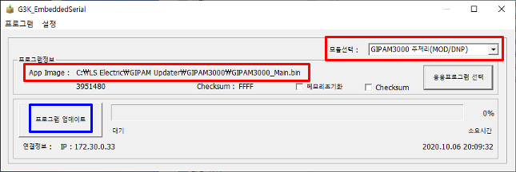
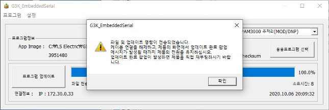
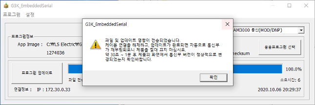
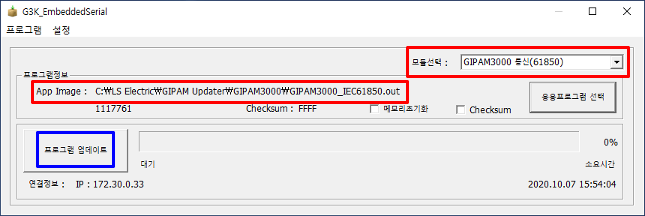
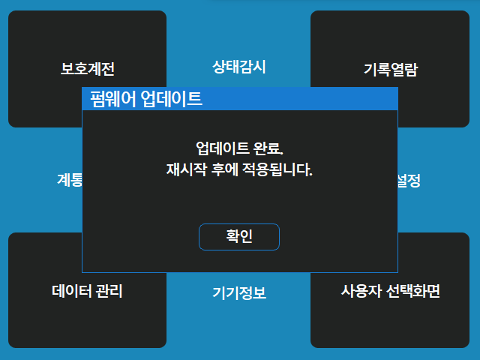

# GIPAM Firmware Updater HoL

# Goal

* Create a windows app from the scratch based on the capture and specification, by using GH Copilot 
* No GH repo available; only local development environment given 
* C# or C++ preferred 
* Just focus on the serveral key functions 

# Metrics

‼️ No concerte figures given to measure 

* Usability
* Efficency
* Effectiveness

# Customer's Specifications 

### 1 . G3K Embedded Serial

\[ 설정 전 디폴트 화면 ] 

##### 모듈 선택 

* GIPAM3000 주처리(61850) : file name - GIPAM3000\_Main\_xxx.bin
* GIPAM3000 통신(61850) : file name - GIPAM3000\_IEC61850\_xxx.out
* GIPAM3000 통신(MOD/DNP) : file name - GIPAM3000\_ModbusDNP3\_xxx.bin

&#x20;   ⚠️ Actually, another module was listed in the customer's specfication, but hard to tell it from others

&#x20;   ⚠️ GIPAM3000 주처리(MOD/DNP) : dropped off 

##### 메모리 초기화 

* 박스 체크를 하면, 설정값&이벤트가 모두 초기화된다
  * 일반적으로는 체크하지 않고, 프로그램 업데이트 진행하면 됨
* 박스 체크를 하는 경우: 기능추가로 설정 메모리가 변경된 경우에만 사용
  * “메모리 초기화”가 필요한 경우에는 별도 공지

##### Checksum

* Checksum 박스를 체크 후, “응용프로그램 선택”을 통해 다운로드할 파일을 선택
* 선택한 파일의 Checksum을 계산한 후에 “App Image”에 파일이 보여짐

##### 응용 프로그램 선택

* “모듈 선택”에 맞는 응용프로그램을 선택

##### 메뉴 

* 설정 
  * IP 설정
    * Default IP (제품 전면) 
      * Check : USB 사용
      
      * Uncheck : IP 사용 
      
  * 통신 모델 변경 
    * DNP를 선택하고 모델변경 버튼

      
    * MODBUS를 선택하고 모델변경 버튼

      

### 2. 모듈 선택 후 실행 전후 예시 화면 

##### &#x20;   GIPAM3000 주처리(61850)

&#x20;       \[ 주처리 : 설정 후 업데이트 전 화면 ] 

&#x20;       \[ 주처리 : 업데이트 후 결과 화면 ] 

##### &#x20;   GIPAM3000 통신(MOD/DNP)

&#x20;       \[ MODBUS/DNP : 설정 후 업데이트 전 화면 ] 

&#x20;       \[ MODBUS/DNP : 업데이트 후 결과 화면 ] 

##### &#x20;   GIPAM3000 통신(61850)

&#x20;       \[ GIPAM3000 통신(61850) : 설정 후 업데이트 전 화면 ] 

&#x20;       \[ GIPAM3000 통신(61850) : 업데이트 후 결과 화면 ] 

### 3. Screen play on the embedded device

* During the update

* On completion

