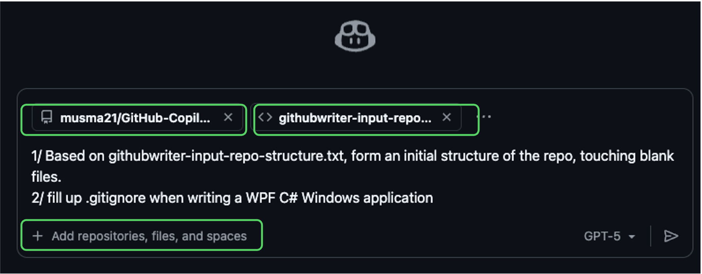

# HoL Structure & githubwrite Usage Guide

## How to use githubwrite

The "githubwrite" Copilot Chat capability uses a structure/spec markdown file as contextual guidance to generate, refactor, and document code inside the current repository.

### ✅ What you CAN do

- Generate new source files matching a described directory tree.
- Insert WPF/.NET boilerplate (e.g., `App.xaml`, `MainWindow.xaml`, `.csproj`).
- Propose `.gitignore` entries for platform and tooling artifacts.
- Expand documentation sections (README encryption notes, lab guides).
- Suggest safe git workflows (fetch, branch, commit, push) as commands.
- Refactor simple logic into `Services/` or `ViewModels/` layers.
- Provide prompt examples (async operations, MVVM bindings, localization).
- Enumerate architectural layout & future extension ideas.
- Add localization placeholders and basic MVVM patterns.

### ❌ What you CANNOT (or should not expect) it to do

- Create a brand‑new remote GitHub repository automatically (manual or `gh` CLI required).
- Push commits without explicit user confirmation/tools (it only suggests commands).
- Read secrets outside the workspace or exfiltrate encrypted data.
- Decrypt git-crypt content without proper GPG key configured.
- Execute GUI apps or long‑running installers.
- Guarantee licensing/legal compliance beyond inserting provided text.
- Perform binary security scanning or vulnerability auditing.
- Purge published sensitive history without you running rewrite tools.
- Resolve complex merge conflicts without human validation.

### 📸 GH Copilot Chat githubwrite Screenshot

Single capture showing a structure spec used in GH Copilot Chat to drive repository edits:



---

## Repository Structure

The below layout is what GH Copilot chat suggested. After creating a repo by yourself, just ask GH Copilot agent to initially touch all directories and files in VSCode : 

```text
GitHub-Copilot-HoL/
│
├── README.md                        # Repository overview and Hands-on Labs intro
├── LICENSE                          # Root license
│
└── MockWinAppInstaller/             # WPF sample application (HoL target)
    ├── README.md                    # Project-level description
    ├── LICENSE                      # Project-specific (duplicate or custom) license
    ├── MockWinAppInstaller.sln      # Visual Studio solution file
    ├── .gitignore                   # Project-local ignore rules (WPF/VS)
    │
    ├── docs/                        # Documentation and supporting materials
    │   ├── copilot-instructions.md  # GitHub Copilot usage guidance & prompt examples
    │   ├── design-spec.md           # Architectural and component design specification
    │   └── assets/                  # Images referenced by docs
    │       ├── architecture-diagram.png  # Architecture diagram
    │       └── ui-wireframe.png          # UI wireframe
    │
    └── src/                         # WPF application source code
        ├── MockWinAppInstaller.csproj    # .NET project file (WPF)
        ├── App.xaml                       # Application resource root & startup URI
        ├── App.xaml.cs                    # Application class code-behind
        ├── MainWindow.xaml                # Main window XAML UI
        ├── MainWindow.xaml.cs             # Main window code-behind
        ├── ViewModels/
        │    └── MainViewModel.cs          # Primary ViewModel (MVVM)
        ├── Services/
        │    ├── FileService.cs            # File selection & basic I/O service
        │    ├── ChecksumService.cs        # Checksum/hash computation service
        │    └── UpdateSimulator.cs        # Update workflow simulation service
        ├── Properties/
        │    ├── AssemblyInfo.cs           # Assembly metadata / ThemeInfo
        │    ├── Resources.resx            # Neutral (default) resources
        │    └── Resources.ko.resx         # Korean localized resources
        │
        ├── bin/                           # Build output (excluded by .gitignore)
        │   ├── Debug/
        │   └── Release/
        │
        └── obj/                           # Intermediate build artifacts (excluded)
```